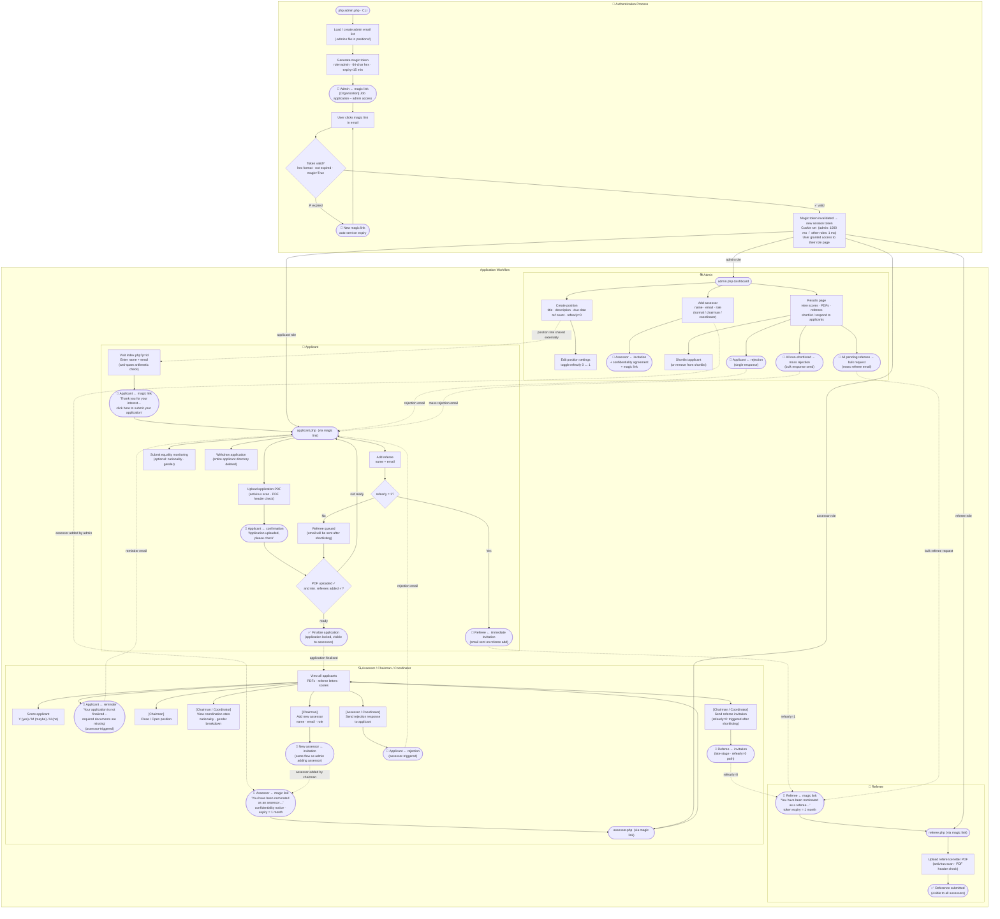

# positions — Application Workflow Flowchart

```mermaid
flowchart TB

  %% ═══════════════════════════════════════════════════════════
  %%  AUTHENTICATION  (top)
  %% ═══════════════════════════════════════════════════════════
  subgraph AUTH["🔐  Authentication Process"]
    direction LR

    CLI(["php admin.php  ·  CLI"])
    LOAD["Load / create admin email list\n(.admins file in positions/)"]
    GENTOK["Generate magic token\nrole=admin · 64-char hex · expiry=15 min"]
    EADMIN(["📧 Admin ← magic link\n[Organization] Job application – admin access"])
    CLICK["User clicks magic link\nin email"]
    VTOK{"Token valid?\nhex format · not expired · magic=True"}
    REGEN(["📧 New magic link\nauto-sent on expiry"])
    COOKIE["Magic token invalidated → new session token\nCookie set  (admin: 1000 mo  /  other roles: 1 mo)\nUser granted access to their role page"]

    CLI --> LOAD --> GENTOK --> EADMIN --> CLICK
    CLICK --> VTOK
    VTOK -->|"✓ valid"| COOKIE
    VTOK -->|"✗ expired"| REGEN --> CLICK
  end

  %% ═══════════════════════════════════════════════════════════
  %%  SWIM LANES
  %% ═══════════════════════════════════════════════════════════
  subgraph SWIM["Application Workflow"]
    direction LR

    %% ── Admin ─────────────────────────────────────────────────
    subgraph ADM["🛠️  Admin"]
      direction TB
      A1(["admin.php dashboard"])
      A2["Create position\ntitle · description · due date\nref count · refearly=0"]
      A3["Edit position settings\ntoggle refearly  0 ↔ 1"]
      A4["Add assessor\nname · email · role\n(normal / chairman / coordinator)"]
      A5(["📧 Assessor ← invitation\n+ confidentiality agreement\n+ magic link"])
      A6["Results page\nview scores · PDFs · referees\nshortlist / respond to applicants"]
      A7["Shortlist applicant\n(or remove from shortlist)"]
      A8(["📧 Applicant ← rejection\n(single response)"])
      A9(["📧 All non-shortlisted ← mass rejection\n(bulk response send)"])
      A10(["📧 All pending referees ← bulk request\n(mass referee email)"])

      A1 --> A2 --> A3
      A1 --> A4 --> A5
      A1 --> A6
      A6 --> A7
      A6 --> A8
      A6 --> A9
      A6 --> A10
    end

    %% ── Applicant ─────────────────────────────────────────────
    subgraph APP["📝  Applicant"]
      direction TB
      AP1["Visit index.php?p=id\nEnter name + email\n(anti-spam arithmetic check)"]
      AP2(["📧 Applicant ← magic link\n'Thank you for your interest…\nclick here to submit your application'"])
      AP3(["applicant.php  (via magic link)"])
      AP4["Upload application PDF\n(antivirus scan · PDF header check)"]
      AP5(["📧 Applicant ← confirmation\n'Application uploaded, please check'"])
      AP6["Add referee\nname + email"]
      AP7{"refearly = 1?"}
      AP8(["📧 Referee ← immediate invitation\n(email sent on referee add)"])
      AP9["Referee queued\n(email will be sent after shortlisting)"]
      AP10["Submit equality monitoring\n(optional: nationality · gender)"]
      AP11{"PDF uploaded ✓\nand min. referees added ✓?"}
      AP12(["✅ Finalize application\n(application locked, visible to assessors)"])
      AP13["Withdraw application\n(entire applicant directory deleted)"]

      AP1 --> AP2 --> AP3
      AP3 --> AP4 --> AP5
      AP3 --> AP6 --> AP7
      AP7 -->|"Yes"| AP8
      AP7 -->|"No"| AP9
      AP3 --> AP10
      AP5 --> AP11
      AP9 --> AP11
      AP11 -->|"not ready"| AP3
      AP11 -->|"ready"| AP12
      AP3 --> AP13
    end

    %% ── Referee ───────────────────────────────────────────────
    subgraph REF["📎  Referee"]
      direction TB
      R1(["📧 Referee ← magic link\n'You have been nominated as a referee…'\ntoken expiry = 1 month"])
      R2(["referee.php  (via magic link)"])
      R3["Upload reference letter PDF\n(antivirus scan · PDF header check)"]
      R4(["✅ Reference submitted\n(visible to all assessors)"])

      R1 --> R2 --> R3 --> R4
    end

    %% ── Assessor / Chairman / Coordinator ─────────────────────
    subgraph ASS["🔍  Assessor / Chairman / Coordinator"]
      direction TB
      AS1(["📧 Assessor ← magic link\n'You have been nominated as an assessor…'\nconfidentiality notice · expiry = 1 month"])
      AS2(["assessor.php  (via magic link)"])
      AS3["View all applicants\nPDFs · referee letters · scores"]
      AS4["Score applicant\nY (yes) / M (maybe) / N (no)"]
      AS5(["📧 Applicant ← reminder\n'Your application is not finalized –\nrequired documents are missing'\n(assessor-triggered)"])
      AS6["[Chairman]\nClose / Open position"]
      AS7["[Chairman / Coordinator]\nView coordination stats\nnationality · gender breakdown"]
      AS8["[Chairman]\nAdd new assessor\nname · email · role"]
      AS9(["📧 New assessor ← invitation\n(same flow as admin adding assessor)"])
      AS10["[Chairman / Coordinator]\nSend referee invitation\n(refearly=0: triggered after shortlisting)"]
      AS11(["📧 Referee ← invitation\n(late-stage · refearly=0 path)"])
      AS12["[Assessor / Coordinator]\nSend rejection response\nto applicant"]
      AS13(["📧 Applicant ← rejection\n(assessor-triggered)"])

      AS1 --> AS2 --> AS3
      AS3 --> AS4
      AS3 --> AS5
      AS3 --> AS6
      AS3 --> AS7
      AS3 --> AS8 --> AS9
      AS3 --> AS10 --> AS11
      AS3 --> AS12 --> AS13
    end
  end

  %% ═══════════════════════════════════════════════════════════
  %%  Cross-lane connections
  %% ═══════════════════════════════════════════════════════════
  COOKIE -->|"admin role"| A1
  COOKIE -->|"applicant role"| AP3
  COOKIE -->|"referee role"| R2
  COOKIE -->|"assessor role"| AS2

  A2 -.->|"position link shared externally"| AP1
  A4 -.->|"assessor added by admin"| AS1
  AS9 -.->|"assessor added by chairman"| AS1

  AP8 -.->|"refearly=1"| R1
  A10 -.->|"bulk referee request"| R1
  AS11 -.->|"refearly=0"| R1

  AP12 -.->|"application finalized"| AS3

  A8 -.->|"rejection email"| AP3
  A9 -.->|"mass rejection email"| AP3
  AS5 -.->|"reminder email"| AP3
  AS13 -.->|"rejection email"| AP3
```
