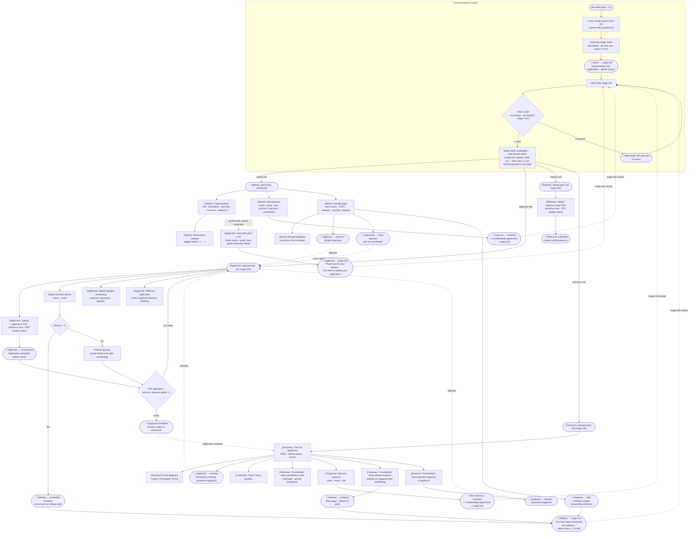

# positions — Application Workflow Flowchart

```mermaid
flowchart TB

  %% ═══════════════════════════════════════════════════════════
  %%  AUTHENTICATION  (top)
  %% ═══════════════════════════════════════════════════════════
  subgraph AUTH["🔐  Authentication Process"]
    direction LR

    CLI(["php admin.php  ·  CLI"])
    LOAD["Load / create admin email list\n(.admins file in positions/)"]
    GENTOK["Generate magic token\nrole=admin · 64-char hex · expiry=15 min"]
    EADMIN(["📧 Admin ← magic link\n[Organization] Job application – admin access"])
    CLICK["User clicks magic link"]
    VTOK{"Token valid?\nhex format · not expired · magic=True"}
    REGEN(["📧 New magic link auto-sent\non expiry"])
    COOKIE["Magic token invalidated → new session token\nCookie set  (admin: 1000 mo  /  other roles: 1 mo)\nAccess granted to role page"]

    CLI --> LOAD --> GENTOK --> EADMIN --> CLICK --> VTOK
    VTOK -->|"✓ valid"| COOKIE
    VTOK -->|"✗ expired"| REGEN --> CLICK
  end

  %% ═══════════════════════════════════════════════════════════
  %%  ADMIN
  %% ═══════════════════════════════════════════════════════════
  COOKIE -->|"admin role"| A1

  A1(["[Admin]  admin.php dashboard"])
  A2["[Admin]  Create position\ntitle · description · due date · ref count · refearly=0"]
  A3["[Admin]  Edit position settings\ntoggle refearly  0 ↔ 1"]
  A4["[Admin]  Add assessor\nname · email · role  (normal / chairman / coordinator)"]
  A5(["📧 Assessor ← invitation\n+ confidentiality agreement + magic link"])
  A6["[Admin]  Results page\nview scores · PDFs · referees · shortlist / respond"]
  A7["[Admin]  Shortlist applicant\n(or remove from shortlist)"]
  A8(["📧 Applicant ← rejection  (single response)"])
  A9(["📧 Applicants ← mass rejection\n(all non-shortlisted)"])
  A10(["📧 Referees ← bulk invitation request\n(all pending referees)"])

  A1 --> A2 --> A3
  A1 --> A4 --> A5
  A1 --> A6
  A6 --> A7
  A6 --> A8
  A6 --> A9
  A6 --> A10

  %% ═══════════════════════════════════════════════════════════
  %%  APPLICANT
  %% ═══════════════════════════════════════════════════════════
  COOKIE -->|"applicant role"| AP3

  AP1["[Applicant]  Visit index.php?p=id\nEnter name + email  (anti-spam arithmetic check)"]
  AP2(["📧 Applicant ← magic link\n'Thank you for your interest…\nclick here to submit your application'"])
  AP3(["[Applicant]  applicant.php  (via magic link)"])
  AP4["[Applicant]  Upload application PDF\n(antivirus scan · PDF header check)"]
  AP5(["📧 Applicant ← confirmation\n'Application uploaded, please check'"])
  AP6["[Applicant]  Add referee\nname + email"]
  AP7{"refearly = 1?"}
  AP8(["📧 Referee ← immediate invitation\n(email sent on referee add)"])
  AP9["Referee queued\n(email will be sent after shortlisting)"]
  AP10["[Applicant]  Submit equality monitoring\n(optional: nationality · gender)"]
  AP11{"PDF uploaded ✓\nand min. referees added ✓?"}
  AP12(["✅ Application finalized\n(locked, visible to assessors)"])
  AP13["[Applicant]  Withdraw application\n(entire applicant directory deleted)"]

  A2 -.->|"position link shared externally"| AP1
  AP1 --> AP2
  AP2 -.->|"magic link clicked"| CLICK
  AP3 --> AP4 --> AP5
  AP3 --> AP6 --> AP7
  AP7 -->|"Yes"| AP8
  AP7 -->|"No"| AP9
  AP3 --> AP10
  AP5 --> AP11
  AP9 --> AP11
  AP11 -->|"not ready"| AP3
  AP11 -->|"ready"| AP12
  AP3 --> AP13

  %% ═══════════════════════════════════════════════════════════
  %%  REFEREE
  %% ═══════════════════════════════════════════════════════════
  COOKIE -->|"referee role"| R2

  R1(["📧 Referee ← magic link\n'You have been nominated as a referee…'\ntoken expiry = 1 month"])
  R2(["[Referee]  referee.php  (via magic link)"])
  R3["[Referee]  Upload reference letter PDF\n(antivirus scan · PDF header check)"]
  R4(["✅ Reference submitted\n(visible to all assessors)"])

  AP8 --> R1
  A10 --> R1
  R1 -.->|"magic link clicked"| CLICK
  R2 --> R3 --> R4

  %% ═══════════════════════════════════════════════════════════
  %%  ASSESSOR / CHAIRMAN / COORDINATOR
  %% ═══════════════════════════════════════════════════════════
  COOKIE -->|"assessor role"| AS2

  AS2(["[Assessor]  assessor.php  (via magic link)"])
  AS3["[Assessor]  View all applicants\nPDFs · referee letters · scores"]
  AS4["[Assessor]  Score applicant\nY (yes) / M (maybe) / N (no)"]
  AS5(["📧 Applicant ← reminder\n'Documents missing'  (assessor-triggered)"])
  AS6["[Chairman]  Close / Open position"]
  AS7["[Chairman / Coordinator]  View coordination stats\nnationality · gender breakdown"]
  AS8["[Chairman]  Add new assessor\nname · email · role"]
  AS9(["📧 New assessor ← invitation\n+ confidentiality agreement + magic link"])
  AS10["[Chairman / Coordinator]  Send referee invitation\n(refearly=0: triggered after shortlisting)"]
  AS11(["📧 Referee ← invitation\n(late-stage · refearly=0 path)"])
  AS12["[Assessor / Coordinator]  Send rejection response\nto applicant"]
  AS13(["📧 Applicant ← rejection  (assessor-triggered)"])

  A5 -.->|"magic link clicked"| CLICK
  AP12 -.->|"application finalized"| AS3
  AS2 --> AS3
  AS3 --> AS4
  AS3 --> AS5
  AS3 --> AS6
  AS3 --> AS7
  AS3 --> AS8 --> AS9
  AS9 -.->|"magic link clicked"| CLICK
  AS3 --> AS10 --> AS11
  AS11 --> R1
  AS3 --> AS12 --> AS13

  %% ═══════════════════════════════════════════════════════════
  %%  Email feedback to applicant
  %% ═══════════════════════════════════════════════════════════
  A8 -.->|"rejection"| AP3
  A9 -.->|"mass rejection"| AP3
  AS5 -.->|"reminder"| AP3
  AS13 -.->|"rejection"| AP3
```
